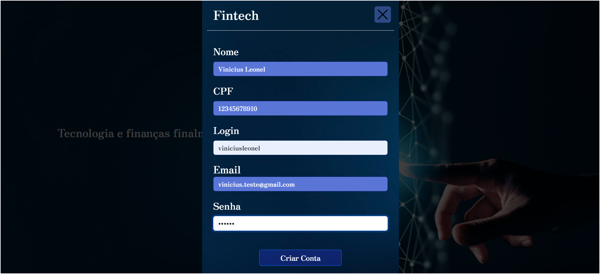

# Fintech Application

## Descrição
A aplicação Fintech é uma plataforma que permite aos usuários gerenciar suas finanças pessoais, incluindo o cadastro e controle de receitas, despesas e investimentos. O sistema oferece uma interface amigável e funcionalidades para facilitar o acompanhamento financeiro.

## Funcionalidades
- **Cadastro de Usuário**: Permite que novos usuários se registrem na plataforma.
- **Login de Usuário**: Usuários podem fazer login para acessar suas contas.
- **Gerenciamento de Receitas**: Cadastro, edição e exclusão de receitas.
- **Gerenciamento de Despesas**: Cadastro, edição e exclusão de despesas.
- **Gerenciamento de Investimentos**: Cadastro, edição e exclusão de investimentos.
- **Listagem de Receitas, Despesas e Investimentos**: Visualização de todas as receitas, despesas e investimentos cadastrados.
- **Modal de Confirmação**: Modal para confirmar ações como exclusão de receitas, despesas e investimentos.
- **Exclusão de Usuário em Efeito Cascata**: Exclusão de um usuário e todas as suas receitas, despesas e investimentos associados em um banco relacional.

## Tecnologias Utilizadas
- **Java**: Linguagem de programação principal.
- **JSP**: Para a construção das páginas web.
- **JSTL**: Para a manipulação de dados nas páginas JSP.
- **Bootstrap**: Framework CSS para estilização e responsividade.
- **Oracle**: Banco de dados para armazenamento de informações.

## Imagens da Aplicação

## HomePage

## HomePage - Abrir Conta

## HomePage - Entrar

## UserPage - Usuário

## Menu Cadastrar

## Menu Listar

## Cadastro de Despesas

## Lista de Despesas

## Cadastro de Receitas

## Lista de Receitas

## Cadastro de Investimentos

## Lista de Investimentos

## Código Fonte
O código fonte completo do projeto está disponível no [GitHub](https://github.com/viniciusleonel/crud-fintech).

**Criado por**: [Vinicius Leonel](https://www.linkedin.com/in/viniciuslps/)
